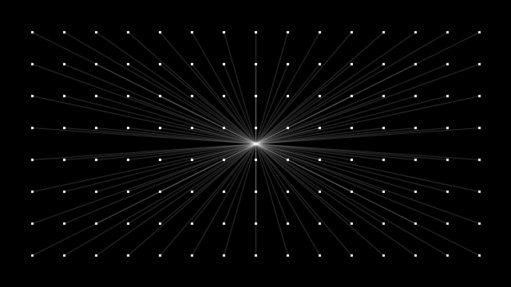

JavaScript Control Structures
=============================

.. topic:: Quick Overview of Day

    Discuss JavaScript control structures.

Comments
---------

Anything after ``//`` will be a comment on that line. Not really a control structure, but you should know it.

Operators
----------

JavaScript is odd when it comes to checking for equality (truthy/falsey problems with ==), so we use three equal signs when checking for equality.

Relational

- ``===`` exactly equals
- ``!==`` does not equal
- ``=`` assignment
- ``+=`` add or concatenate
- ``-=`` subtract
- ``>`` greater than
- ``>=`` greater than or equal to
- ``<`` less than
- ``<=`` less than or equal to 

Logical

- ``&&`` and
- ``||`` or
- ``!`` not

If / Else If / Else
--------------------

.. code-block:: javascript

    let someNumber = prompt("Pick a number");

    if (someNumber < 42) {
        // do something
    }
    else if (someNumber === 42) {
        // do something else
    }
    else {
        // do some default action
    }

While Loops
-----------

.. code-block:: javascript

    let number = 0;

    while (number < 10) {
        console.log(number);
        number = number + 1;
    }

Do-While Loops
---------------

Guarantees the loop will happen at least once.

.. code-block:: javascript

    let answer;
    do {
        answer = prompt("Best NBA team?");
    }
    while (answer !== "Spurs");

For Loop
--------

.. code-block:: javascript

    for (let number = 10; number > 0; number = number - 1) {
        console.log(number);
    }
    console.log("Blastoff!");

Break
-----

Forces a loop to end immediately. Just include a ``break;`` statement inside the loop somewhere.

Try/Catch
----------

Useful if you are going to run code that might cause an error.

.. code-block:: javascript

    try {
        somethingNotDefined();
    } catch (theError) {
        console.log("Uh oh. You just had the following error: " + theError);    // console.log() is the same as print()
    }

Functions
----------

.. code-block:: javascript

    function adder(first, second) {
        theAnswer = first + second;
        return theAnswer;
    }

Can return a value, or not. If not, result is ``undefined``.

Throwing Exception
-------------------

If you want to create code that deals gracefully with possible errors. You can `read more about them here <https://eloquentjavascript.net/3rd_edition/08_error.html#h_zT3755/aOp>`_ . Consider:

.. code-block:: javascript

    function multiply(firstNumber, secondNumber) {
        if (typeof firstNumber !== "number" || typeof secondNumber !== "number") {
            throw "You cannot multiply unless both arguments are numbers!";
        }

        return firstNumber * secondNumber;
    }   

    print(multiply(4, 3))       // 12
    print(multiply(4, "foo"))   // Error in console: "You cannot multiply unless both arguments are numbers!"
                                // also crashes the program, since the there was no code to catch the exception

    try {
        multiply(4, "foo");
    } 
    catch (e) {
        console.log(e);         // printed in console: "You cannot multiply unless both arguments are numbers!"
    }                           //   doesn't crash the program, since the exception was caught!

p5js Example
------------------

p5js has a number of functions that get called automatically for you. The most important ones for now are ``setup()``, ``draw()``, ``keyTyped()`` and ``mousePressed()``. 

.. code-block:: javascript

    function setup() {
        createCanvas(600, 600);
    }

    function draw() {
        background(255);
        fill(0);
        ellipse(mouseX, mouseY, 50, 50);
    }

As you saw in the last sketch, we can get the current mouse position by simply using the keywords mouseX and mouseY. Another incredibly useful set of keywords is ``pmouseX`` and ``pmouseY``, which stand for "previous" mouseX and mouseY locations.

Your Turn
---------

I want to have Processing make the line that is being drawn be wider when the mouse moves faster horizontally, and thinner when the mouse is moving slower horizontally. See if you can make that happen.

Here's a couple of hints:

- the formula for calculating the speed of the mouse's horizontal motion is the absolute value of the difference between mouseX and pmouseX.
- abs(-5) will return 5 in Processing
- look up the strokeWeight function in the Processing.org reference (Links to an external site.)Links to an external site.

When you manage to get it working, show me your revised, working version of the sketch. Just put your hand up and be prepared to show it to me.

Your Turn
----------

Create a sketch that makes the following happen:

- when the user clicks on the sketch with the left mouse button, draw a rectangle there

- when the user clicks on the sketch with the right mouse button, draw a circle there

- when the user hits the "w" key, reset the sketch with a white background

- when the user hits the "b" key, reset the sketch with a black background
  

p5js helpful variables
-----------------------

In addition to what we've already done, here's a quick list of system variables that you will likely find useful:

.. caution:: Double check that these are the same for p5js -- list is originally for Processing

- width - Width (in pixels) of canvas
- height - Height (in pixels) of canvas
- frameCount - Number of frames processed
- frameRate - Rate that frames are processed (per second)
- displayWidth - Width (in pixels) of entire screen
- displayHeight - Height (in pixels) of entire screen
- key - Most recent key pressed on the keyboard
- keyCode - Numeric code for key pressed on keyboard
- keyPressed - True or false? Is a key pressed?
- mousePressed - True or false? Is the mouse pressed?
- mouseButton - Which button is pressed? Left, right, or center

Random
------

The random() function allows us to generate psuedo-random numbers for use in our code (psuedo-random in theory, but they are random enough that you don't have to care about it for what we're doing...).

Your Turn
---------

Create a sketch that:

- when the mouse is on the left-hand side of your screen, rectangles should be drawn (all over the screen). The rectangles should be various shades of grey.

- when the mouse is on the right-hand side of the screen, circles should still be drawn all over the screen (in random colours).

Constrain
----------

Keeps a value within a certain range.

Example -- move image with mouse, but don't let it leave the left side of the screen.

Local vs Global Scope
-----------------------

Use ``let`` and ``const`` instead of ``var``. ``let`` gives block based scoping, which is much better. For the most part, you can just look at an example and use ``let`` anywhere you see ``var``.

Your Turn
----------

Bouncing ball demo (just bounce in one direction). Now you add the following features:

- improve the code so that the ball can bounce both vertically AND horizontally.
- bounce on edge of ball (instead of the middle of the ball)
- make the ball speed up or slow down based on some condition (for example, whether the mouse is currently being pressed or not)
- implement at least one additional feature, such as changing the size or color of the ball based on certain conditions

Your Turn
----------

// Daniel Shiffman
// http://www.learningprocessing.com

// Example 5-9: Simple Gravity

See if you can alter the code given above in order to make it so that the square eventually stops bouncing.

Nested Loops
-------------

Loop in a loop. Can draw interesting things.

Try to figure out what this will do **without** running it!

.. code-block:: javascript

    function setup() {
        createCanvas(400, 400);
    }

    function draw() {
        for (let i=0; i<width; i+= 5) {
            for (let j=0; j<height; j+= 5) {
                fill(int(random(255)), int(random(255)), int(random(255)));
                noStroke();
                rect(i, j, 5, 5);
            }
        }
    }

Try to figure out what this will do **without** running it!

.. code-block:: javascript

    function setup() {
        createCanvas(400, 400);
    }

    function draw() {
        for (let i = 50; i < 140; i = i+5) {
            for (let j = 30; j < 75; j = j+5) {
                point(i, j);
            }
        }
    }

Your Turn
----------

You should now attempt to create a sketch that draws a basic chess board (alternating black and white squares). After getting the basic functionality working, see if you can find any ways of making your code more efficient. If you aren't familiar with chess, here's what it should look like:

.. image:: images/Chess_Board.svg

Your Turn
---------

How about this one?

