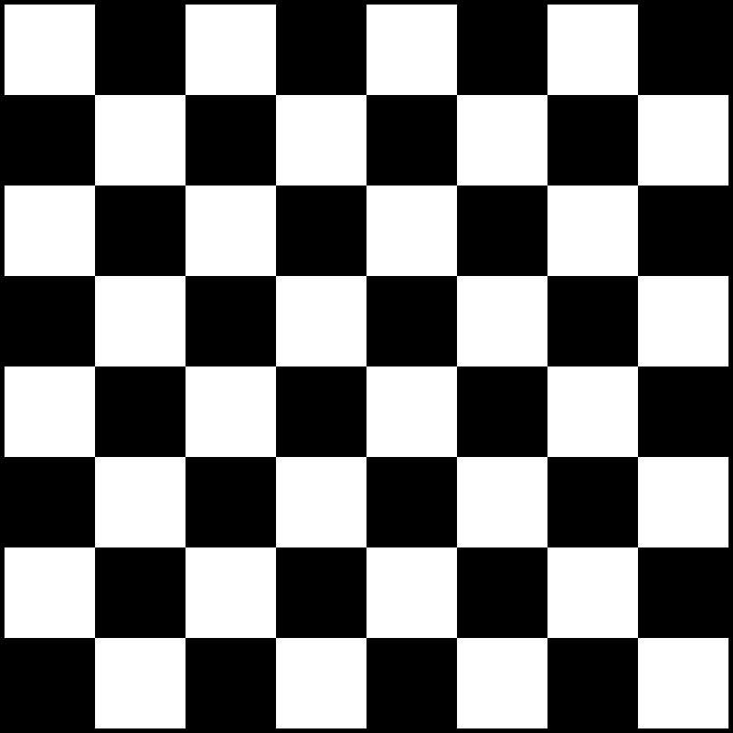
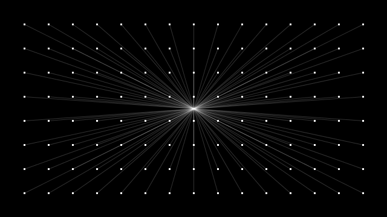

Loops and Nested Loops
=============================

.. topic:: Quick Overview of Day

    Explore for and while loops. Explore nested loops.

Remember that the ``draw()`` loop is already an infinite loop.

While Loops
-------------

While Loop Example::

  let i = 0;
  while (i < 10) {
    console.log(i);
    i++;
  }

For Loops
----------

For Loop Example::

  for (let i = 0; i < 10; i++) {
    console.log(i);
  }

Class Demo
-----------

Create a sketch that draws something similar to the following (do it with both a for and while loop):

Refactoring Example 1
----------------------

`Open this code, and refactor it using a for loop and while loop <https://editor.p5js.org/schellenberg/sketches/99xcneo7q>`_ 

Class Demo
-----------

Adapt the code above to add color to each of the rings of the target (hint: count up from 0, and use an array of colors to fill in the circles).

Nested Loops
-------------

Loop in a loop. Can draw interesting things.

Try to figure out what this will do **without** running it!

.. code-block:: javascript

    function setup() {
      createCanvas(300, 250);
    }

    function draw() {
      for (let i=0; i<width; i+= 5) {
        for (let j=0; j<height; j+= 5) {
          fill(int(random(255)), int(random(255)), int(random(255)));
          noStroke();
          rect(i, j, 5, 5);
        }
      }
    }

Once you thnk you know what it will do, you can `check your guess by clicking here <https://editor.p5js.org/schellenberg/present/RpkErQVDV>`_.

Try to figure out what this will do **without** running it!

.. code-block:: javascript

    function setup() {
      createCanvas(windowWidth, windowHeight);
    }

    function draw() {
      for (let x = 0; x < width; x += 25) {
        for (let y = 0; y < height; y += 25) {
          fill(dist(x, y, mouseX, mouseY));
          circle(x, y, 10);
        }
      }
    }

Once you thnk you know what it will do, you can `check your guess by clicking here <https://editor.p5js.org/schellenberg/present/xsaxKiUw8>`_.

Your Turn
----------

You should now attempt to create a sketch that draws a basic chess board (alternating black and white squares). After getting the basic functionality working, see if you can find any ways of making your code more efficient. If you aren't familiar with chess, here's what it should look like:

If you finish before the rest of the class, see if you can draw this one:

Class Demo
-----------

Create a grid. Store color data for the grid in a 2 dimensional array. When you click on a square, swap the colors of the current cell, and any cell orthogonally adjacent to it (NESW neighbors). It should be something like `this former student project <https://wmcicompsci.ca/makeitblue/>`_ , but just a static number of rows and columns.

To talk about/include:

- ``const`` variables (for number of rows/columns)
- using functions to improve the readability of your code

.. Refactoring Example 2
.. ----------------------

.. `Open this code, and refactor it using a for loop and an array <https://editor.p5js.org/schellenberg/sketches/thcEnD26l>`_ 

.. Demo
.. -----

.. Draw a archery target image using while loop. Then do it using a for loop. Then do it with a for loop, counting up from 0, and using an array of colors to fill in the circles.

Loops Practice Quiz
--------------------

Note that the same code fragments are used in each question below. You might find it useful to sketch out on paper what you think each code fragment will create, then match your answers with the images provided in the questions below.

.. mchoice:: loops-practice-quiz-1
  :random:

  Which of the following code fragments would generate the image below?
  
  .. image:: images/loops-1.png
  
  - .. code-block:: javascript

      for (let i = 0; i < 20; i++) {
        line(i*2, 0, i * 15, height);
      }

    + Yes! Nicely done!

  - .. code-block:: javascript

      for (let i = 40; i > 0; i--) {
        rect(i * 2, i * 2, i * 2, i * 5);
      }

    - Try again!

  - .. code-block:: javascript

      let i = 0;
      while (i < width) {
        line(0, i, width, i);
        i += 10;
      }

    - Try again!

  - .. code-block:: javascript

      for (let i = 0; i < width; i += 10) {
        line(i, 0, i, height);
      }

    - Try again!

  - .. code-block:: javascript

      for (let i = 0; i < width; i++) {
        if (i % 15 === 0) {
          line(0, 0, width, i);
        }
      }

    - Try again!

  - .. code-block:: javascript

      for (let i = 125; i > 50; i -= 15) {
        rect(i, i + 50, 10, i);
      }

    - Try again!

  - .. code-block:: javascript

      let i = 50;
      while (i < 170) {
        rect(i, i + 50, i, 10);
        i += 20;
      }

    - Try again!

.. mchoice:: loops-practice-quiz-2
  :random:

  Which of the following code fragments would generate the image below?
  
  .. image:: images/loops-2.png
  
  - .. code-block:: javascript

      for (let i = 0; i < 20; i++) {
        line(i*2, 0, i * 15, height);
      }

    - Try again!

  - .. code-block:: javascript

      for (let i = 40; i > 0; i--) {
        rect(i * 2, i * 2, i * 2, i * 5);
      }

    + Yes! Nicely done!

  - .. code-block:: javascript

      let i = 0;
      while (i < width) {
        line(0, i, width, i);
        i += 10;
      }

    - Try again!

  - .. code-block:: javascript

      for (let i = 0; i < width; i += 10) {
        line(i, 0, i, height);
      }

    - Try again!

  - .. code-block:: javascript

      for (let i = 0; i < width; i++) {
        if (i % 15 === 0) {
          line(0, 0, width, i);
        }
      }

    - Try again!

  - .. code-block:: javascript

      for (let i = 125; i > 50; i -= 15) {
        rect(i, i + 50, 10, i);
      }

    - Try again!

  - .. code-block:: javascript

      let i = 50;
      while (i < 170) {
        rect(i, i + 50, i, 10);
        i += 20;
      }

    - Try again!

.. mchoice:: loops-practice-quiz-3
  :random:

  Which of the following code fragments would generate the image below?
  
  .. image:: images/loops-3.png
  
  - .. code-block:: javascript

      for (let i = 0; i < 20; i++) {
        line(i*2, 0, i * 15, height);
      }

    - Try again!

  - .. code-block:: javascript

      for (let i = 40; i > 0; i--) {
        rect(i * 2, i * 2, i * 2, i * 5);
      }

    - Try again!

  - .. code-block:: javascript

      let i = 0;
      while (i < width) {
        line(0, i, width, i);
        i += 10;
      }

    + Yes! Nicely done!

  - .. code-block:: javascript

      for (let i = 0; i < width; i += 10) {
        line(i, 0, i, height);
      }

    - Try again!

  - .. code-block:: javascript

      for (let i = 0; i < width; i++) {
        if (i % 15 === 0) {
          line(0, 0, width, i);
        }
      }

    - Try again!

  - .. code-block:: javascript

      for (let i = 125; i > 50; i -= 15) {
        rect(i, i + 50, 10, i);
      }

    - Try again!

  - .. code-block:: javascript

      let i = 50;
      while (i < 170) {
        rect(i, i + 50, i, 10);
        i += 20;
      }

    - Try again!

.. mchoice:: loops-practice-quiz-4
  :random:

  Which of the following code fragments would generate the image below?
  
  .. image:: images/loops-4.png
  
  - .. code-block:: javascript

      for (let i = 0; i < 20; i++) {
        line(i*2, 0, i * 15, height);
      }

    - Try again!

  - .. code-block:: javascript

      for (let i = 40; i > 0; i--) {
        rect(i * 2, i * 2, i * 2, i * 5);
      }

    - Try again!

  - .. code-block:: javascript

      let i = 0;
      while (i < width) {
        line(0, i, width, i);
        i += 10;
      }

    - Try again!

  - .. code-block:: javascript

      for (let i = 0; i < width; i += 10) {
        line(i, 0, i, height);
      }

    + Yes! Nicely done!

  - .. code-block:: javascript

      for (let i = 0; i < width; i++) {
        if (i % 15 === 0) {
          line(0, 0, width, i);
        }
      }

    - Try again!

  - .. code-block:: javascript

      for (let i = 125; i > 50; i -= 15) {
        rect(i, i + 50, 10, i);
      }

    - Try again!

  - .. code-block:: javascript

      let i = 50;
      while (i < 170) {
        rect(i, i + 50, i, 10);
        i += 20;
      }

    - Try again!

.. mchoice:: loops-practice-quiz-5
  :random:

  Which of the following code fragments would generate the image below?
  
  .. image:: images/loops-5.png
  
  - .. code-block:: javascript

      for (let i = 0; i < 20; i++) {
        line(i*2, 0, i * 15, height);
      }

    - Try again!

  - .. code-block:: javascript

      for (let i = 40; i > 0; i--) {
        rect(i * 2, i * 2, i * 2, i * 5);
      }

    - Try again!

  - .. code-block:: javascript

      let i = 0;
      while (i < width) {
        line(0, i, width, i);
        i += 10;
      }

    - Try again!

  - .. code-block:: javascript

      for (let i = 0; i < width; i += 10) {
        line(i, 0, i, height);
      }

    - Try again!

  - .. code-block:: javascript

      for (let i = 0; i < width; i++) {
        if (i % 15 === 0) {
          line(0, 0, width, i);
        }
      }

    + Yes! Nicely done!

  - .. code-block:: javascript

      for (let i = 125; i > 50; i -= 15) {
        rect(i, i + 50, 10, i);
      }

    - Try again!

  - .. code-block:: javascript

      let i = 50;
      while (i < 170) {
        rect(i, i + 50, i, 10);
        i += 20;
      }

    - Try again!

.. mchoice:: loops-practice-quiz-6
  :random:

  Which of the following code fragments would generate the image below?
  
  .. image:: images/loops-6.png
  
  - .. code-block:: javascript

      for (let i = 0; i < 20; i++) {
        line(i*2, 0, i * 15, height);
      }

    - Try again!

  - .. code-block:: javascript

      for (let i = 40; i > 0; i--) {
        rect(i * 2, i * 2, i * 2, i * 5);
      }

    - Try again!

  - .. code-block:: javascript

      let i = 0;
      while (i < width) {
        line(0, i, width, i);
        i += 10;
      }

    - Try again!

  - .. code-block:: javascript

      for (let i = 0; i < width; i += 10) {
        line(i, 0, i, height);
      }

    - Try again!

  - .. code-block:: javascript

      for (let i = 0; i < width; i++) {
        if (i % 15 === 0) {
          line(0, 0, width, i);
        }
      }

    - Try again!

  - .. code-block:: javascript

      for (let i = 125; i > 50; i -= 15) {
        rect(i, i + 50, 10, i);
      }

    + Yes! Nicely done!

  - .. code-block:: javascript

      let i = 50;
      while (i < 170) {
        rect(i, i + 50, i, 10);
        i += 20;
      }

    - Try again!

.. mchoice:: loops-practice-quiz-7
  :random:

  Which of the following code fragments would generate the image below?
  
  .. image:: images/loops-7.png
  
  - .. code-block:: javascript

      for (let i = 0; i < 20; i++) {
        line(i*2, 0, i * 15, height);
      }

    - Try again!

  - .. code-block:: javascript

      for (let i = 40; i > 0; i--) {
        rect(i * 2, i * 2, i * 2, i * 5);
      }

    - Try again!

  - .. code-block:: javascript

      let i = 0;
      while (i < width) {
        line(0, i, width, i);
        i += 10;
      }

    - Try again!

  - .. code-block:: javascript

      for (let i = 0; i < width; i += 10) {
        line(i, 0, i, height);
      }

    - Try again!

  - .. code-block:: javascript

      for (let i = 0; i < width; i++) {
        if (i % 15 === 0) {
          line(0, 0, width, i);
        }
      }

    - Try again!

  - .. code-block:: javascript

      for (let i = 125; i > 50; i -= 15) {
        rect(i, i + 50, 10, i);
      }

    - Try again!

  - .. code-block:: javascript

      let i = 50;
      while (i < 170) {
        rect(i, i + 50, i, 10);
        i += 20;
      }

    + Yes! Nicely done!
