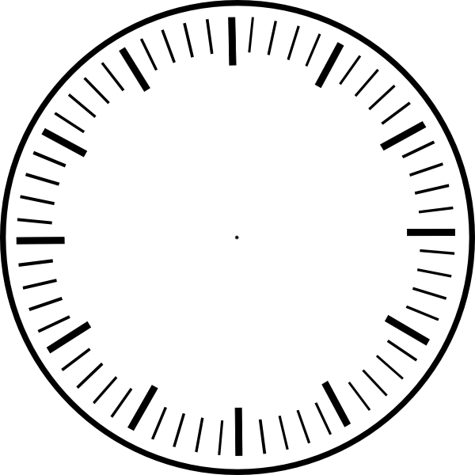

Translation and Rotation
=============================

.. topic:: Quick Overview of Day

    Things you should know about translating and rotating in p5js.

Translations
---------------

https://processing.org/tutorials/transform2d/

Rotations
----------

https://processing.org/tutorials/transform2d/

Rotating Towards Something (like the cursor)
----------------------------------------------

``atan2``

Your Turn
----------

Draw a clock face that looks like this:

If you finish early, see if you can get it to have hands that actually work! Look in the reference for seconds(), etc.

Extra for Experts
--------------------

Try to make something like this happen:

`https://www.youtube.com/watch?v=duNzKIRJHuA <https://www.youtube.com/watch?v=duNzKIRJHuA>`_

Might want to look up ``frameCount``, and remember how to use modular arithmetic.
