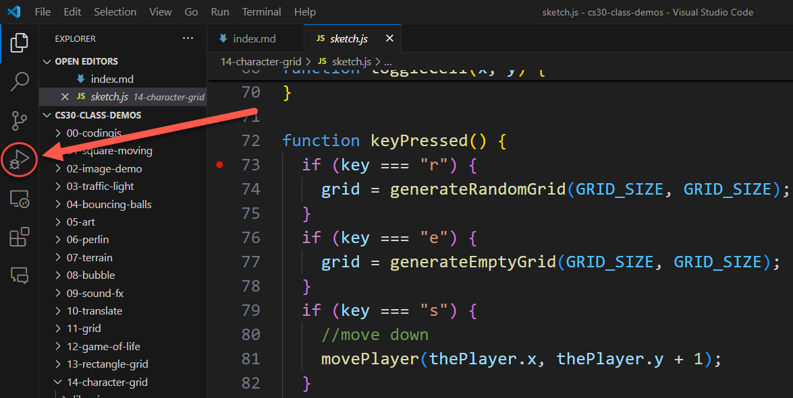
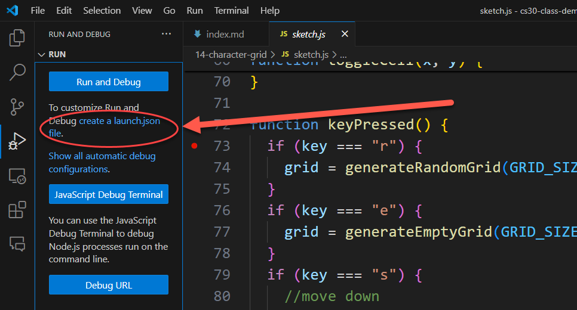
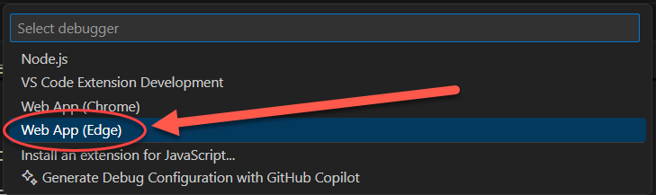
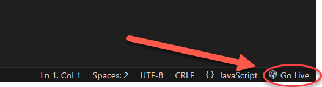
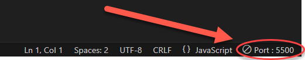
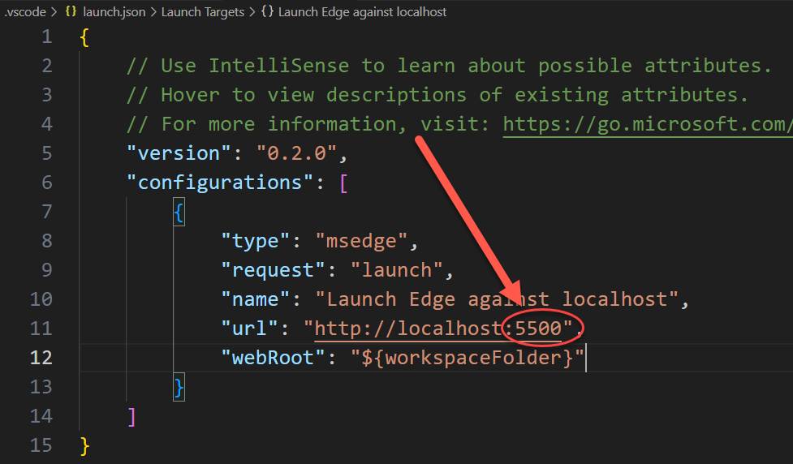
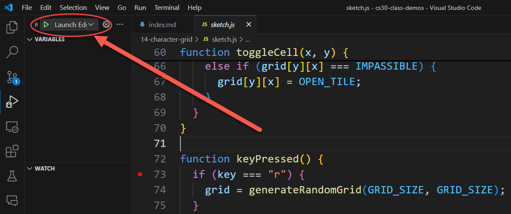
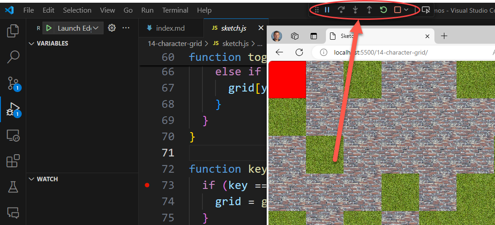
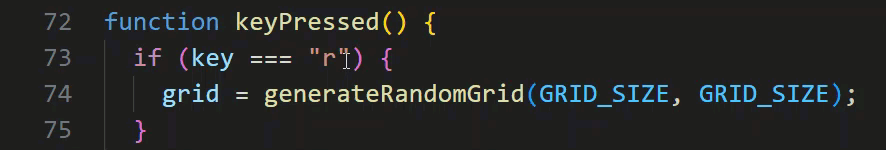
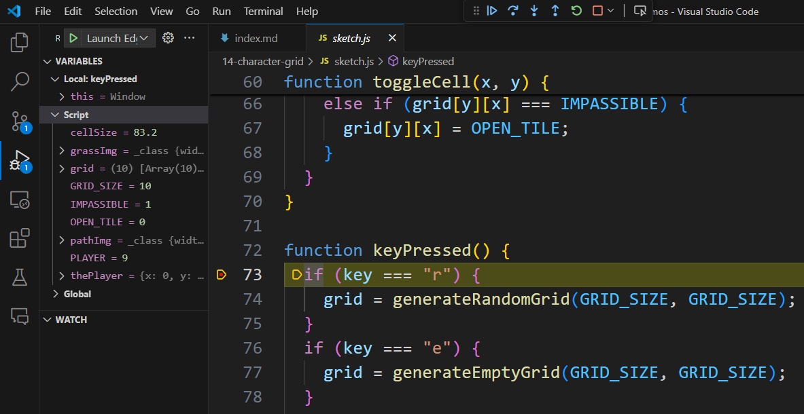

Debugging JavaScript
=============================

.. topic:: Quick Overview of Day

    Learn how to debug JavaScript using the VS Code editor.

Configuring the Debugger
-------------------------

To configure the debugger in VS Code, you need to create a launch.json file. This file tells VS Code how to run your code in the debugger. To create this file, click on the debug icon on the left hand sidebar:

Now click on the words ``create a launch.json file`` to create a new launch.json file:

Choose the web browser you want to use (Chrome or Edge) when doing debugging:

You now need to know which port you are using when you click the "Go Live" button in VS Code. The default port is 5500. To see the port, click the "Go Live" button in the bottom right corner of VS Code:

Now you can see the port number where the Go Live server is running:

Now edit the lauch.json file to match the port number you are using:

Using The Debugger
------------------

Now that you have the debugger set up, you can use it to help you find and fix problems in your code. To start the debugger, click the green play button in the debug pane:

This will open a new browser window with your code running in it. In the VS Code window, you will see a new pane at the top of the screen that shows allows you to step through your code:

You can use the buttons in this pane to step through your code one line at a time, or to continue running your code until the next breakpoint.

A breakpoint is a place in your code where the debugger will stop running your code and let you inspect the values of variables and other things. To add a breakpoint, click on the left side of the line number where you want the breakpoint to be:

When your code hits a breakpoint, you can see the values of variables in the "Variables" pane:

You can also set specific variables/values to watch in the "Watch" pane:

.. image:: images/watch-panel.png
