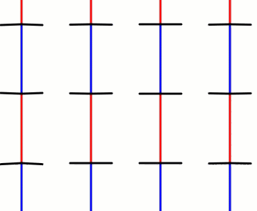
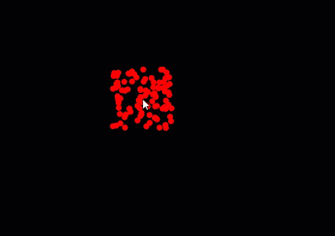
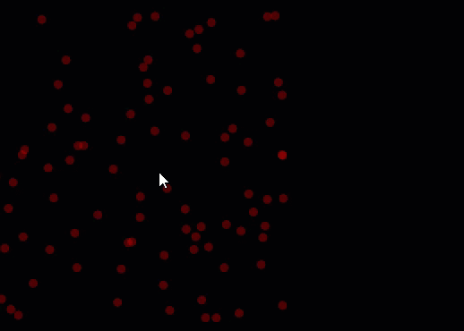

.. qnum::
   :prefix: objects-quiz
   :start: 1

.. _objects_practice_quiz:

Objects Practice Quiz
-------------------------

Question 1
~~~~~~~~~~~

.. fillintheblank:: objects-practice-quiz-1

    The following code has a syntax error. What line of code is it on?

    .. code-block:: javascript
        :linenos:

        let blake;

        function setup() {
          createCanvas(windowWidth, windowHeight);
          blake = new Walker(width/2, height/2, "blue");
        }

        function draw() {
          blake.move();
          blake.display();
        }

        class Walker {
          constructor(x, y, theColor) {
            this.x = x;
            this.y = y;
            this.color = theColor;
            this.speed = 4;
            this.radius = 1;
          }

          display() {
            fill(this.color);
            stroke(this.color);
            circle(this.x, this.y, radius*2);
          }

          move() {
            let theChoice = random(100);

            if (theChoice < 25) { //up
              this.y -= this.speed;
            }
            else if (theChoice < 50) { //down
              this.y += this.speed;
            }
            else if (theChoice < 75) { //left
              this.x -= this.speed;
            }
            else { //right
              this.x += this.speed;
            }
          }
        }

    - :25: Great!
      :.*: Try again! Is there any place where we forget to use this.someVariable?

Question 2
~~~~~~~~~~~

.. fillintheblank:: objects-practice-quiz-2

    The following code has a syntax error. What line of code is it on?

    .. code-block:: javascript
        :linenos:

        let blake;

        function setup() {
          createCanvas(windowWidth, windowHeight);
          blake = new Walker(width/2, height/2);
        }

        function draw() {
          blake.move();
          blake.display();
        }

        class Walker {
          constructor(x, y, theColor) {
            this.x = x;
            this.y = y;
            this.color = theColor;
            this.speed = 4;
            this.radius = 1;
          }

          display() {
            fill(this.color);
            stroke(this.color);
            circle(this.x, this.y, this.radius*2);
          }

          move() {
            let theChoice = random(100);

            if (theChoice < 25) { //up
              this.y -= this.speed;
            }
            else if (theChoice < 50) { //down
              this.y += this.speed;
            }
            else if (theChoice < 75) { //left
              this.x -= this.speed;
            }
            else { //right
              this.x += this.speed;
            }
          }
        }

    - :5: Great!
      :.*: Try again! Do we pass in everything required when instantiating blake?

Question 3
~~~~~~~~~~~

Write the code to use a class called Illusion. The class is already defined for you. Your job is to create an instance of this class such that every time the mouse is pressed, the togglePause() command is called for your instance of the illusion. The illusion should be displayed each time the draw loop executes. Consider the (intentionally not commented) Illusion constructor to think through how to call the constructor properly.

You can write the code in `this p5js web editor <https://editor.p5js.org/schellenberg/sketches/INDa3AUEJ>`_ starter code tab.

This question cannot be auto-graded. If you do it correctly, you should get something similar to the following:

Question 4
~~~~~~~~~~~

Write the code to make a class called Particle. When a new Particle is created, it should take in an x and y value for it's initial location. When it is created, the Particle should set a size, dx, dy and color. The dx and dy values should be randomized. The Particle class should have two functions: update() and display(). The update() function should apply the Particles speed to it's location, and the display() function should draw an appropriated colored circle on the screen at the Particle's location.

You can write the code in `this p5js web editor starter code tab <https://editor.p5js.org/schellenberg/sketches/xLYyxl9u_>`_.

This question cannot be auto-graded. If you do it correctly, you should get something similar to the following:

**Extra for Experts**

*If you'd like an additional challenge, see if you can make the Particle's slowly become more transparent. When they can no longer be seen, remove them from the array.*

