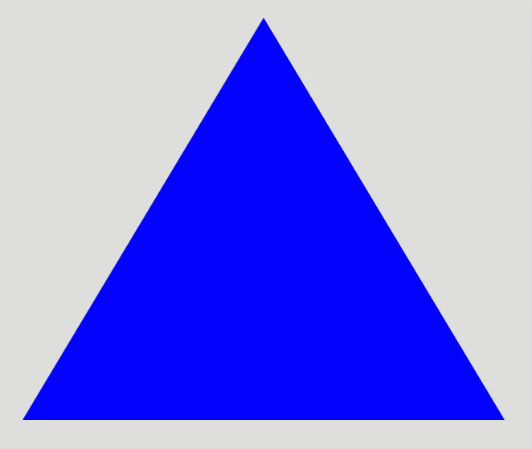

Recursion Explanation and Demos
==================================

Simply put, recursion is a function that calls itself.

Refresh your memory of factorials. Define factorials recursively (math, then code).

Practice problems from `CodingJS Recursion-1 <https://codingjs.wmcicompsci.ca/>`_ section.

Sierpinski Triangle
--------------------

Make a Sierpinski triangle drawing program in p5. 

Key ideas:

- use an object to hold point data (x and y coordinates)
- have a function that calculates the midpoint between two coordinates, and returns the resulting coordinate
- create a sierpinski(points, degree) recursive function. Use the degree as both the exit clause, as well as the index value to select a fill color from a list of colors

Fractal Circles
----------------

`Check out the demo here <https://p5js.org/examples/structure-recursion.html>`_.

Fractal Tree
-------------

If students are interested in another demo, build something like this `Coding Train fractal tree demo <https://www.youtube.com/watch?v=0jjeOYMjmDU>`_.

Extensions
-----------

Maze generator demo (already have a version built in my demos folder...). Warning -- This is a much more involved/challenging demo.